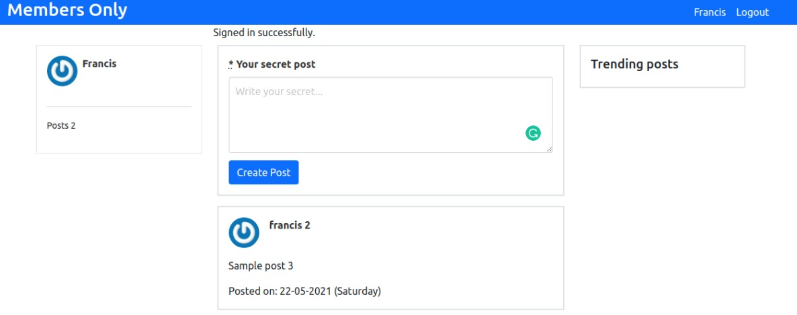
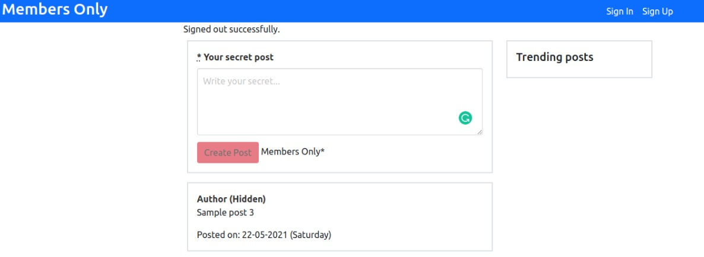

# Members Only (Rails Authentication)

>  In this project involves building an exclusive clubhouse where members can write anonymous posts. Inside the clubhouse, members can see who the author of a post is but, outside, they can only see the story and wonder who wrote it.

This project demonstrates my understanding of Cookies, Sessions, Flashes, Controller filters and Authentication.  This was mostly achieved by installing the Devise gem which pragmatically handles all of these features. Devise comes with many useful modules which enables me to feature a sign-up/sign-in page, keep track of user sessions, encryptically store passwords using password digests and do so much more without having to build my own authentication from scratch.

## Built With

- Ruby 2.7.0

- Ruby on Rails 6.1.1

- Devise gem

- RuboCop

- Bootstrap and Bulma

## Prerequisites
Install [Ruby](https://www.theodinproject.com/courses/ruby-programming/lessons/installing-ruby-ruby-programming), [Rails](https://www.theodinproject.com/paths/full-stack-ruby-on-rails/courses/ruby-on-rails/lessons/your-first-rails-application-ruby-on-rails), sqlite3, text editior, browser, git

## Getting Started

- To get a local copy of this project, run
`git clone https://github.com/francisuloko/members_only.git`

- Change into the project directory, run
`cd members-only`

- Install gems and dependencies, run
`bundle install`

- To set up your database, run
`/bin/rails db:migrate`

- To start the app in your browser, run
`/bin/rails server`

- To Explore the project in your browser, visit
`http://localhost:3000`

- To close the server, run
`Ctrl C`

- To interact with the app and models from console, run
`/bin/rails console`

## Author

👤 **Francis Uloko**

- GitHub: [Francis Uloko](https://github.com/francisuloko)
- Twitter: [Francis Uloko](https://twitter.com/francisuloko)
- LinkedIn: [Francis Uloko](https://linkedin.com/in/francisuloko)

## 🤝 Contributing

Contributions, issues, and feature requests are welcome!

Feel free to check the [issues page](https://github.com/francisuloko/members_only/issues).

## Show your support

Give a ⭐️ if you like this project!

## Acknowledgments

- [Andy Leverenz](https://github.com/justalever)

## 📝 License

This project is [MIT](https://en.wikipedia.org/wiki/MIT_License) licensed.
